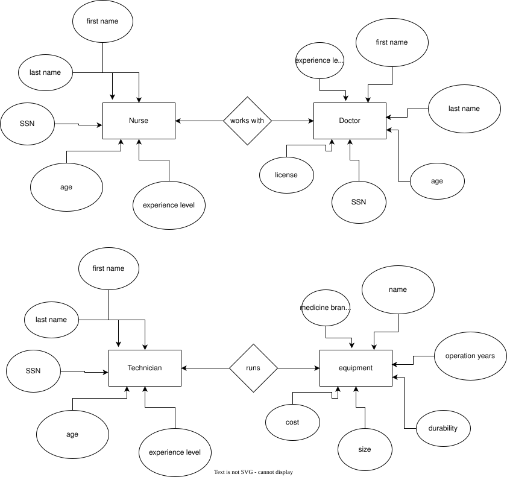

# Hospital Database Design — Oracle SQL Project

## Overview

**Problem Statement:** A healthcare system needs to generate a master directory showing every currently admitted patient alongside the official name of the medical facility where they are receiving treatment.

This project demonstrates that I can design relational databases and query them in **Oracle SQL**. This multi-part project focused on normalization, schema creation, and data retrieval.

---

### Entity-Relationship Diagram


## Lab 3 – Database Normalization (1NF → 3NF)

Here, I normalized a single unstructured patient–hospital dataset from **First Normal Form (1NF)** to **Third Normal Form (3NF)**.

Key work included:

* Eliminating repeating groups and multi-valued attributes
* Separating entities into **Patient**, **Hospital**, and **Specialty** tables
* Introducing **primary keys** and **foreign keys**

**Focus:** Database normalization, 1NF, 2NF, 3NF, primary key, foreign key, junction table, relational design.

---

## Lab 4 – Oracle SQL Schema & Data Modeling

Here, I implemented the normalized design as an actual **Oracle SQL database schema**.

Key work included:

* Creating relational tables using `CREATE TABLE`
* Defining **primary key** and **foreign key constraints**
* Implementing referential integrity across entities
* Populating tables with data using `INSERT`
* Creating a **many-to-many relationship** using a junction table (`HOSPITAL_SPECIALTY`)

**Focus:** Oracle SQL, schema design, relational database, foreign key constraints, data integrity.

### Hospital_Specialty Mapping Table (Junction Table)
This table resolves the many-to-many relationship using two Foreign Keys (`FK`).


| ID | HOSPITAL_ID (FK) | SPECIALTY_ID (FK) |
| :--- | :--- | :--- |
| 111 | 11 | 1 |
| 112 | 22 | 2 |
| 113 | 33 | 3 |
| 114 | 44 | 4 |
| 115 | 55 | 5 |


---

## Lab 5 – SQL Queries & Data Retrieval

Here, I queried the Oracle database to retrieve meaningful information.

Key work included:

* Writing **INNER JOIN** queries across multiple tables
* Querying many-to-many relationships
* Sorting query results using `ORDER BY`
* Producing reports such as patient–hospital mappings and hospital specialties

**Focus:** SQL joins, INNER JOIN, relational queries, data retrieval, Oracle database querying.


### Referential Integrity & Constraints Logic
To ensure data integrity between the entities, I implemented foreign key constraints. (see `lab5-queries` folder for my full SQL code)

For example, the junction table enforces that a specialty cannot be mapped to a non-existent hospital:

```sql
ALTER TABLE HOSPITAL_SPECIALTY 
ADD CONSTRAINT FK_HOSSPECIALTY_HOSPITAL 
FOREIGN KEY (HOSPITAL_ID) REFERENCES HOSPITAL(ID);
```


---

## Technologies Used

* **Oracle SQL**
* [Oracle Database Platform](https://www.oracle.com/database/technologies/oracle-free-sql/)

